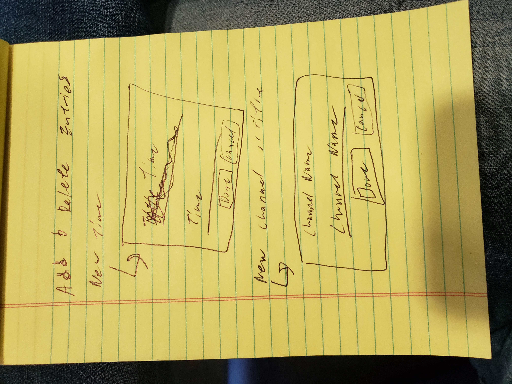

In contrast with previous design we will have little bars on the left to signify the draggability of all areas. 

We also have a tiered heirarchy where channels and titles are distinct from the beginning

Also the main sections are collapsible in general 

Otherwise much of the initial and final design are the same. However the inital design being done in HTML/CSS/JS vanilla isn't very easy to modify. So I've decided to refactor. Also the way the data is being used it would be quite difficult to match with the concept of global drag and drop. 

These image are representations of the modals that would come up when the user is trying to add a new channel and a new title **(I think maybe more information could go here, instruction about what this will do and potentially the time division information as well)**